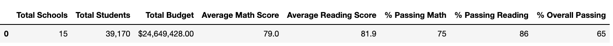
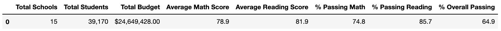
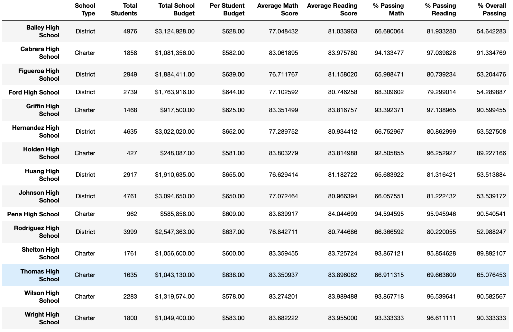
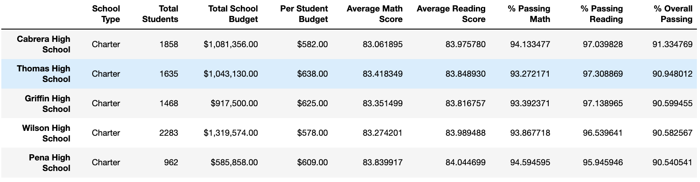
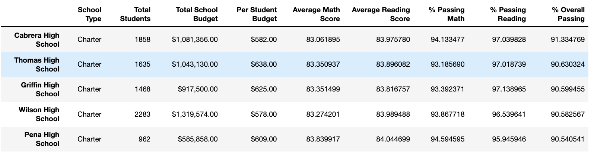
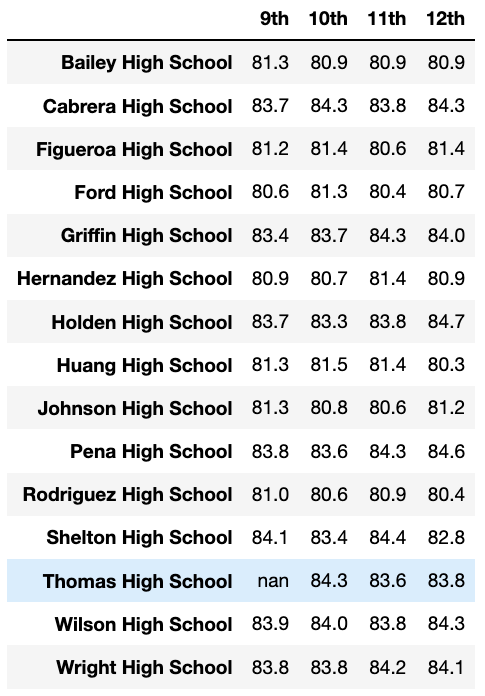
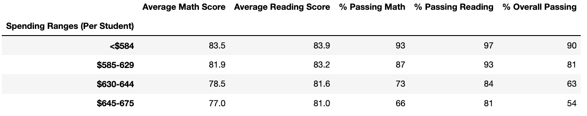
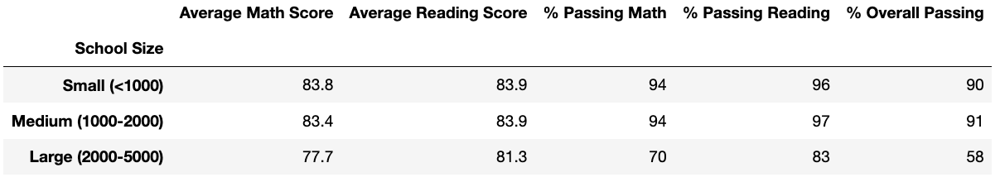
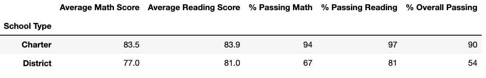

# School District Analysis

## Overview of Project

### Purpose

This purpose of this project was to perform a school district analysis. To uphold state-testing standards, scores suspected of academic dishonesty were removed. The school district analysis was repeated and compared to the first analysis to see how the removed scores affected the overall analysis.

## Results

* **How is the district summary affected?**

    Removal of potentially altered scores slightly lowered scores in the district summary:

    First analysis:
    

    Second analysis:
    

* **How is the school summary affected?**

    Thomas High School's school summary scores were the only scores affected in the second analysis, with passing percentages decreasing by ~30%. All other school scores stayed the same:

    First Analysis:
     

    Second Analysis:
    

* **How does replacing the ninth graders’ math and reading scores affect Thomas High School’s performance relative to the other schools?**

    After replacing Thomas High School's ninth grade math and reading scores, its average schools and passing percentages rose slightly. However, it held onto its rank of number two in the top schools based on overall passing percentage.

    **Top 5 school ranking before removing Thomas High School's ninth grade math and reading scores:**

    

    **Top 5 school ranking after removing Thomas High School's ninth grade math and reading scores:**

    

* **How does replacing the ninth-grade scores affect the following:**

    - **Math and reading scores by grade**
    Replacing the ninth-grade scores yielded different results only for Thomas High School's ninth grade reading and math scores. The original analysis showed Thomas High School's ninth grade reading and math scores as 83.7% and 83.6%, respectively. The second analysis shows both results as "nan", as illustrated in the screenshot of the reading scores:

         

    - **Scores by school spending**
    There was no significant difference to scores by school spending The repeat analysis yielded the same results:

        

    - **Scores by school size**
    There was no significant difference to scores by school size. The repeat analysis yielded the same results:

        

    - **Scores by school type**
    There was no significant difference to scores by school type. The repeat analysis yielded the same results:

        

## Summary
After replacing Thomas High School's ninth grade math and reading scores, the district summary scores were slightly lowered and Thomas High School's scores decreased in the school summary, top 5 ranking scores, and ninth grade reading and math scores.